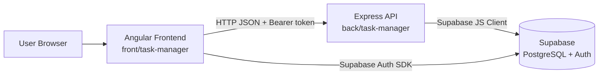
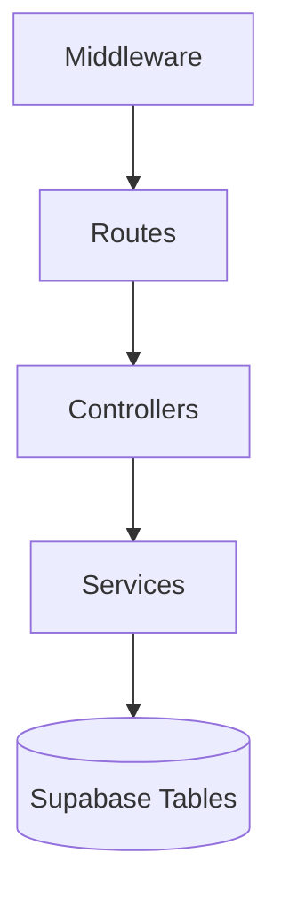
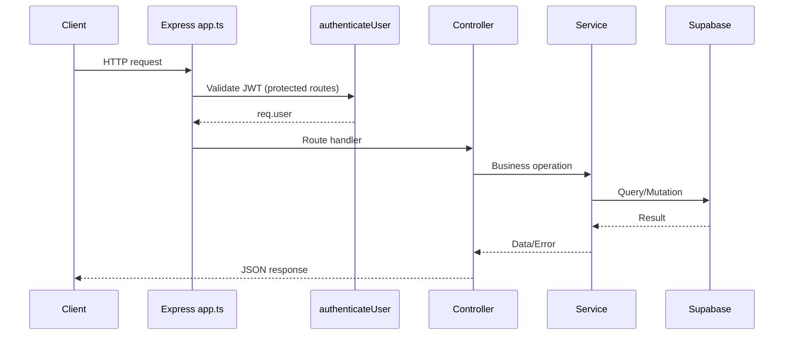
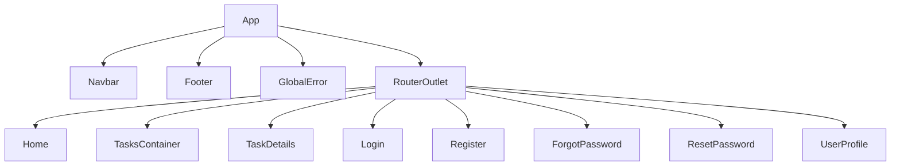
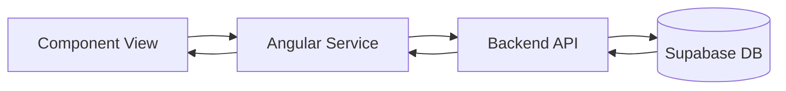

# Architecture

## System Overview

```mermaid
flowchart LR
    U[User Browser]
    F[Angular Frontend<br/>front/task-manager]
    B[Express API<br/>back/task-manager]
    S[(Supabase<br/>PostgreSQL + Auth)]

    U --> F
    F -->|HTTP JSON + Bearer token| B
    B -->|Supabase JS Client| S
    F -->|Supabase Auth SDK| S
```

## Backend Layered Architecture

```mermaid
flowchart TD
    R[Routes]
    C[Controllers]
    SV[Services]
    D[(Supabase Tables)]
    M[Middleware]

    M --> R
    R --> C
    C --> SV
    SV --> D
```

## Backend Request Flow

```mermaid
sequenceDiagram
    participant Client
    participant App as Express app.ts
    participant Auth as authenticateUser
    participant Controller
    participant Service
    participant Supabase

    Client->>App: HTTP request
    App->>Auth: Validate JWT (protected routes)
    Auth-->>App: req.user
    App->>Controller: Route handler
    Controller->>Service: Business operation
    Service->>Supabase: Query/Mutation
    Supabase-->>Service: Result
    Service-->>Controller: Data/Error
    Controller-->>Client: JSON response
```

## Frontend Component Composition

```mermaid
flowchart TD
    App[App]
    Navbar[Navbar]
    Footer[Footer]
    GE[GlobalError]
    RouterOutlet[RouterOutlet]

    Home[Home]
    Tasks[TasksContainer]
    TaskDetails[TaskDetails]
    Login[Login]
    Register[Register]
    Forgot[ForgotPassword]
    Reset[ResetPassword]
    Profile[UserProfile]

    App --> Navbar
    App --> RouterOutlet
    App --> GE
    App --> Footer

    RouterOutlet --> Home
    RouterOutlet --> Tasks
    RouterOutlet --> TaskDetails
    RouterOutlet --> Login
    RouterOutlet --> Register
    RouterOutlet --> Forgot
    RouterOutlet --> Reset
    RouterOutlet --> Profile
```

## Frontend Data Flow

```mermaid
flowchart LR
    V[Component View]
    SVC[Angular Service]
    API[Backend API]
    DB[(Supabase DB)]

    V --> SVC
    SVC --> API
    API --> DB
    DB --> API
    API --> SVC
    SVC --> V
```
