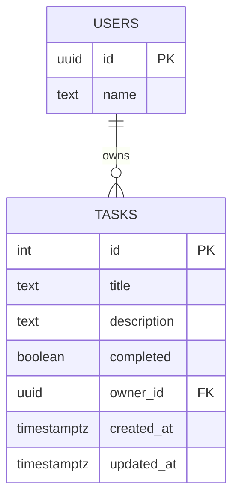

# Database Schema

This schema documentation is based on:

- `back/task-manager/src/types/database.types.ts`
- `back/task-manager/src/types/supabase.ts`
- Task/user service usage in backend code

## Entity Relationship Diagram



## `users` Table

| Column | Type | Nullable | Key | Description |
| --- | --- | --- | --- | --- |
| `id` | `uuid/text` | No | PK | User id (linked to auth identity). |
| `name` | `text` | No |  | Display name. |

### Service Usage

- Read profile: `GET /api/users/me`
- Update profile: `PUT /api/users/me`
- Disable account: `DELETE /api/users/me` (service sets `enabled = false` if column exists)

## `tasks` Table

| Column | Type | Nullable | Key | Description |
| --- | --- | --- | --- | --- |
| `id` | `int` | No | PK | Task identifier. |
| `title` | `text` | No |  | Short task title. |
| `description` | `text` | Yes |  | Optional task details. |
| `completed` | `boolean` | No |  | Completion flag. |
| `owner_id` | `uuid/text` | No | FK -> `users.id` | Task owner. |
| `created_at` | `timestamptz` | No |  | Creation timestamp. |
| `updated_at` | `timestamptz` | No |  | Last update timestamp. |

### Service Usage

- List by owner with pagination/filter/sort
- Read by id with owner constraint
- Create/update/delete with owner constraint
- Toggle completion

## Suggested SQL Reference (Logical)

```sql
create table if not exists public.users (
  id uuid primary key,
  name text not null
);

create table if not exists public.tasks (
  id bigint generated by default as identity primary key,
  title text not null,
  description text null,
  completed boolean not null default false,
  owner_id uuid not null references public.users(id),
  created_at timestamptz not null default now(),
  updated_at timestamptz not null default now()
);
```

## Notes

- Backend code references an `enabled` field during user disable operations. If not present in your Supabase table, either add it or adjust `UserService.disableUser`.
- Keep generated type files synchronized with actual Supabase schema to avoid runtime/type drift.
