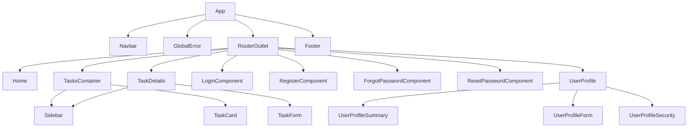
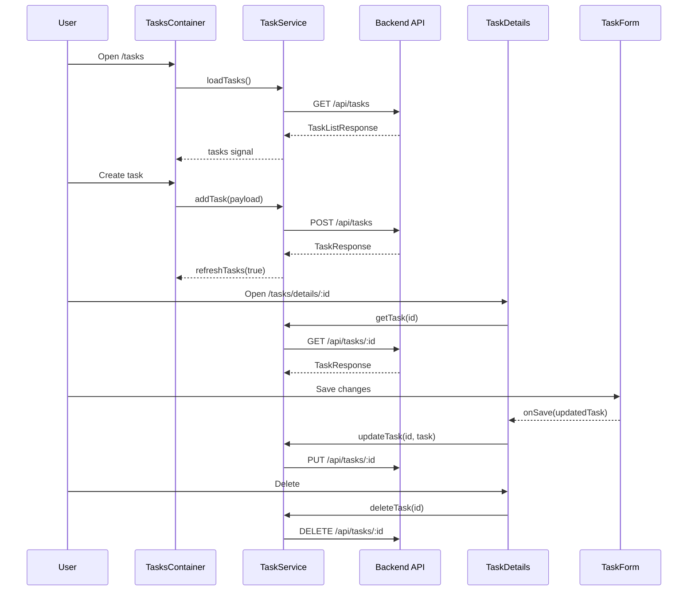

# Frontend Components

Updated documentation for Angular components in `front/task-manager/src/app`.

## Summary

| Component | Selector | File | Role |
| --- | --- | --- | --- |
| App | `app-root` | `src/app/app.ts` | Global shell (navbar, router outlet, errors, footer). |
| Navbar | `app-navbar` | `src/app/UI/navbar/navbar.ts` | Top navigation and current user access. |
| Footer | `app-footer` | `src/app/UI/footer/footer.ts` | Global footer. |
| GlobalError | `app-global-error` | `src/app/UI/global-error/global-error.ts` | Renders global errors from `ErrorService`. |
| Home | `app-home` | `src/app/home/home.ts` | Dashboard with task metrics. |
| TasksContainer | `app-tasks-container` | `src/app/tasks/tasks-container/tasks-container.ts` | Main tasks view (list, filters, sorting, pagination, create). |
| Sidebar | `app-sidebar` | `src/app/UI/sidebar/sidebar.ts` | Task filters and secondary navigation. |
| TaskCard | `app-task-card` | `src/app/tasks/task-card/task-card.ts` | Single task card. |
| TaskDetails | `app-task-details` | `src/app/tasks/task-details/task-details.ts` | Task detail view, toggle, and edit. |
| TaskForm | `app-task-form` | `src/app/tasks/task-form/task-form.ts` | Reactive form for task editing. |
| LoginComponent | `app-login` | `src/app/auth/login/login.ts` | Sign in page. |
| RegisterComponent | `app-register` | `src/app/auth/register/register.ts` | User registration page. |
| ForgotPasswordComponent | `app-forgot-password` | `src/app/pages/forgot-password/forgot-password.component.ts` | Password reset request by email. |
| ResetPasswordComponent | `app-reset-password` | `src/app/pages/reset-password/reset-password.component.ts` | Password change using recovery token. |
| UserProfile | `app-user-profile` | `src/app/user/user-profile/user-profile.ts` | User profile container. |
| UserProfileSummary | `app-user-profile-summary` | `src/app/user/profile-summary/profile-summary.ts` | Read-only user summary. |
| UserProfileForm | `app-user-profile-form` | `src/app/user/profile-form/profile-form.ts` | Profile data editing form. |
| UserProfileSecurity | `app-user-profile-security` | `src/app/user/profile-security/profile-security.ts` | Profile security visual block. |

## Component Interaction

### Main hierarchy



### Task flow (list/create/edit/delete)



### Authentication flow and guards

```mermaid
flowchart LR
    Login[Login/Register] --> AuthService
    AuthService --> SupabaseSDK[Supabase Auth SDK]
    SupabaseSDK --> Session[(Session)]

    Session --> AuthInterceptor
    AuthInterceptor --> BackendAPI[Backend API]

    AuthService --> AuthGuard
    AuthService --> GuestGuard

    AuthGuard --> ProtectedRoutes[/home,/tasks,/me]
    GuestGuard --> AuthRoutes[/auth/login,/auth/register]
```

## Component APIs

### App (`src/app/app.ts`)

- Inputs: none
- Outputs: none
- State:
  - `title: Signal<string>`
- Public methods: none

### Navbar (`src/app/UI/navbar/navbar.ts`)

- Inputs: none
- Outputs: none
- State:
  - `currentUser$`
- Methods:
  - `navigate(path: string): void`

### Footer (`src/app/UI/footer/footer.ts`)

- Inputs: none
- Outputs: none
- Public methods: none

### GlobalError (`src/app/UI/global-error/global-error.ts`)

- Inputs: none
- Outputs: none
- State:
  - `errors` (readonly signal from `ErrorService`)
- Methods:
  - `dismiss(id: string): void`
  - `trackById(_index: number, item: AppErrorItem): string`

### Home (`src/app/home/home.ts`)

- Inputs: none
- Outputs: none
- Methods:
  - `completedCount(): number`
  - `inProgressCount(): number`
  - `totalCount(): number`
  - `getProgressPercentage(): number`
  - `navigateToTasks(): void`

### TasksContainer (`src/app/tasks/tasks-container/tasks-container.ts`)

- Inputs: none (page component)
- Outputs: none
- State:
  - `tasks`, `loading`, `pagination` (signals from `TaskService`)
  - `filterStatus`, `sortOption`, `showCreateForm` (local signals)
  - `filteredTasks` (computed)
  - `createForm` (reactive form)
- Methods:
  - `toggleCreateForm(): void`
  - `createTask(): void`
  - `setFilter(status: 'all' | 'pending' | 'completed'): void`
  - `setSort(option: 'created_desc' | 'created_asc' | 'updated_desc' | 'title_asc' | 'title_desc'): void`
  - `nextPage(): void`
  - `previousPage(): void`
  - `goToPage(page: number): void`
  - `deletingTask(id: number): void`

### Sidebar (`src/app/UI/sidebar/sidebar.ts`)

- Inputs:
  - `mode: string` (required)
- Outputs:
  - `statusChange: 'all' | 'pending' | 'completed'`
- State:
  - `isOpen`, `selectedStatus`
  - `tasks`
  - `totalCount`, `pendingCount`, `completedCount` (computed)
- Methods:
  - `filterByStatus(status: 'all' | 'pending' | 'completed'): void`
  - `toggleSidebar(): void`
  - `closeSidebar(): void`
  - `navigateToTask(id: number): void`

### TaskCard (`src/app/tasks/task-card/task-card.ts`)

- Inputs:
  - `task: Task | null`
  - `loading: boolean`
- Outputs:
  - `delete_: number`
- Methods:
  - `isCompleted(): boolean`
  - `taskDate(): string | undefined`
  - `taskDescription(): string`
  - `taskTitle(): string`
  - `goToDetails(): void`
  - `delete(id: number | null | undefined): void`

### TaskDetails (`src/app/tasks/task-details/task-details.ts`)

- Inputs: none (page component)
- Outputs: none
- State:
  - `showForm`, `loading` (signals)
  - `task` (`toSignal` from route param + `TaskService`)
- Methods:
  - `goBack(): void`
  - `toggleComplete(): void`
  - `deleteTask(): void`
  - `isCompleted(): boolean`
  - `createdAt(): string`
  - `updatedAt(): string`
  - `taskDescription(): string | undefined`
  - `taskTitle(): string`
  - `goToDetails(): void`
  - `editTask(): void`
  - `updateTask(task: Task): void`

### TaskForm (`src/app/tasks/task-form/task-form.ts`)

- Inputs:
  - `task: Task` (required)
  - `showForm: boolean` (required model)
  - `loading: boolean`
- Outputs:
  - `onSave: Task`
- State:
  - `form: FormGroup`
- Methods:
  - `cancel(): void`
  - `saveChanges(): void`

### LoginComponent (`src/app/auth/login/login.ts`)

- Inputs: none
- Outputs: none
- State:
  - `loginForm`, `loading$`, `errorMessage`, `successMessage`
- Methods:
  - `onSubmit(): void`
  - `email` (getter)
  - `password` (getter)

### RegisterComponent (`src/app/auth/register/register.ts`)

- Inputs: none
- Outputs: none
- State:
  - `registerForm`, `loading$`, `errorMessage`, `successMessage`
- Methods:
  - `onSubmit(): void`
  - `name` (getter)
  - `email` (getter)
  - `password` (getter)
  - `confirmPassword` (getter)

### ForgotPasswordComponent (`src/app/pages/forgot-password/forgot-password.component.ts`)

- Inputs: none
- Outputs: none
- State:
  - `forgotPasswordForm`, `loading$`, `errorMessage`, `successMessage`
- Methods:
  - `onSubmit(): void`
  - `emailControl` (getter)

### ResetPasswordComponent (`src/app/pages/reset-password/reset-password.component.ts`)

- Inputs: none
- Outputs: none
- State:
  - `recoveryToken`, `hashErrorMessage`, `apiErrorMessage`, `successMessage`, `isSubmitting`
  - `resetPasswordForm`
- Methods:
  - `ngOnInit(): void`
  - `ngOnDestroy(): void`
  - `onSubmit(): void`
  - `passwordControl` (getter)
  - `confirmPasswordControl` (getter)

### UserProfile (`src/app/user/user-profile/user-profile.ts`)

- Inputs: none
- Outputs: none
- State:
  - `user$`
- Methods:
  - `handleSave(payload: ProfileFormValue): void`
  - `handleCancel(): void`
  - `logout(): void`

### UserProfileSummary (`src/app/user/profile-summary/profile-summary.ts`)

- Inputs:
  - `user: AuthUser` (required)
- Outputs: none
- Public methods: none

### UserProfileForm (`src/app/user/profile-form/profile-form.ts`)

- Inputs:
  - `user: AuthUser` (required)
- Outputs:
  - `onSave: ProfileFormValue`
  - `onCancel: void`
- State:
  - `form: FormGroup`
- Methods:
  - `cancel(): void`
  - `saveChanges(): void`

### UserProfileSecurity (`src/app/user/profile-security/profile-security.ts`)

- Inputs: none
- Outputs: none
- Public methods: none

## Key Dependencies

- `TaskService`: task state/operations (`tasks`, `pagination`, CRUD).
- `AuthService`: session, login/register/logout, password reset.
- `UserService`: profile read/update.
- `ErrorService`: global error notifications.
- Guards:
  - `authGuard` for protected routes.
  - `guestGuard` for authentication routes.

## Quick Usage (integration)

1. `TasksContainer` uses `Sidebar` (filters) + `TaskCard` (item actions).
2. `TaskDetails` uses `TaskForm` for inline editing.
3. `UserProfile` composes `UserProfileSummary`, `UserProfileForm`, `UserProfileSecurity`.
4. `GlobalError` renders notifications from `httpErrorInterceptor`.
